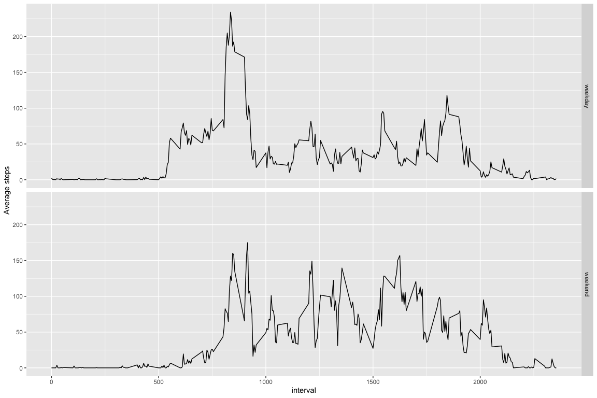

## Set global options

```r
knitr::opts_chunk$set(fig.width=12, fig.height=8, fig.path='figs/',
                      echo=TRUE, warning=FALSE, message=FALSE)
```

## Loading and preprocessing the data

**Instructions:**  

Show any code that is needed to  
- Load the data (i.e. read.csv())  
- Process/transform the data (if necessary) into a format suitable for your analysis  

**Download the [activity dataset][1]**

```r
if(!file.exists("data"))
    dir.create("data")

if(!file.exists("data/activity.zip"))
    download.file("https://d396qusza40orc.cloudfront.net/repdata/data/activity.zip", destfile="data/activity.zip")

if(!file.exists("data/activity.csv"))
    unzip("data/activity.zip", exdir = "data")
```

**Load the data**


```r
df <- read.csv("data/activity.csv", colClasses=c("numeric", "Date", "numeric"))
```

**Summarize the dataset**

```r
summary(df)
```

```
##      steps             date               interval     
##  Min.   :  0.00   Min.   :2012-10-01   Min.   :   0.0  
##  1st Qu.:  0.00   1st Qu.:2012-10-16   1st Qu.: 588.8  
##  Median :  0.00   Median :2012-10-31   Median :1177.5  
##  Mean   : 37.38   Mean   :2012-10-31   Mean   :1177.5  
##  3rd Qu.: 12.00   3rd Qu.:2012-11-15   3rd Qu.:1766.2  
##  Max.   :806.00   Max.   :2012-11-30   Max.   :2355.0  
##  NA's   :2304
```

## What is mean total number of steps taken per day?

**Instructions:**  

For this part of the assignment, you can ignore the missing values in the dataset.  
- Calculate the total number of steps taken per day  
- If you do not understand the difference between a histogram and a barplot, research the difference between them. Make a histogram of the total number of steps taken each day  
- Calculate and report the mean and median of the total number of steps taken per day  

**Calculate the total number of steps taken per day**

```r
library(dplyr)

sdf <- df %>%
    group_by(date) %>%
    summarize_at(vars(steps), sum, na.rm = TRUE)
```

**Histogram of the total number of steps taken each day**

```r
hist(sdf$steps, main="", xlab="Total number of steps in each day")
```

<!-- -->

**Mean and and median of steps taken each day**

```r
sdf %>%
    summarize_at(vars(steps), list(mean=mean, median=median))
```

```
## # A tibble: 1 x 2
##    mean median
##   <dbl>  <dbl>
## 1 9354.  10395
```

## What is the average daily activity pattern?

**Instructions:**  

- Make a time series plot (i.e. type = "l") of the 5-minute interval (x-axis) and the average number of steps taken, averaged across all days (y-axis)
- Which 5-minute interval, on average across all the days in the dataset, contains the maximum number of steps?  
</span>

**Calculate the average number of steps taken in each interval, averaged across all days**


```r
mdf <- df %>%
    group_by(interval) %>%
    summarize_at(vars(steps), mean, na.rm = TRUE)
```

**A time series plot of the average number of steps taken**

```r
plot(mdf, type="l", ylab="Average steps")
```

<!-- -->

**The 5-minute interval, on average across all the days in the dataset, contains the maximum number of stepThe 5-minute is**:  
**<span style="font-size:18px"> 835 </span>**

## Imputing missing values

**Instructions:**  
Note that there are a number of days/intervals where there are missing values (coded as NA). The presence of missing days may introduce bias into some calculations or summaries of the data.

- Calculate and report the total number of missing values in the dataset (i.e. the total number of rows with NAs)  
- Devise a strategy for filling in all of the missing values in the dataset. The strategy does not need to be sophisticated. For example, you could use the mean/median for that day, or the mean for that 5-minute interval, etc.  
- Create a new dataset that is equal to the original dataset but with the missing data filled in.  
- Make a histogram of the total number of steps taken each day and Calculate and report the mean and median total number of steps taken per day. Do these values differ from the estimates from the first part of the assignment? What is the impact of imputing missing data on the estimates of the total daily number of steps?  

**Total number of missing values in the dataset is**  
**<span style="font-size:18px"> 2304 </span>**

**Replace missing values for steps, with the mean value for that interval**


```r
cdf <- df %>%
    inner_join(mdf, by="interval") %>%
    mutate(steps = as.integer(coalesce(steps.x, steps.y))) %>%
    select(steps, date, interval)
```

**Histogram of the total number of steps taken each day**

```r
sdf <- cdf %>%
    group_by(date) %>%
    summarize_at(vars(steps), sum, na.rm = TRUE)

hist(sdf$steps, main="", xlab="Total number of steps in each day")
```

<!-- -->

**Mean and and median of steps taken each day**

```r
sdf %>%
    summarize_at(vars(steps), list(mean=mean, median=median))
```

```
## # A tibble: 1 x 2
##     mean median
##    <dbl>  <int>
## 1 10750.  10641
```

**Observations after imputing**:
- Histogram of total number of steps each day shows that there are less number of days with less than 5000 steps after imputing.
- The mean and median of the number of steps each day seemed to be higher after imputing.

## Are there differences in activity patterns between weekdays and weekends?

**Instructions:**  

For this part the weekdays() function may be of some help here. Use the dataset with the filled-in missing values for this part.
- Create a new factor variable in the dataset with two levels – “weekday” and “weekend” indicating whether a given date is a weekday or weekend day.
- Make a panel plot containing a time series plot (i.e. type = "l") of the 5-minute interval (x-axis) and the average number of steps taken, averaged across all weekday days or weekend days (y-axis). See the README file in the GitHub repository to see an example of what this plot should look like using simulated data.

**Add 'day' column to denote if the day is weekday or weekend day**


```r
wdf <- df %>%
    mutate(day = ifelse(weekdays(date) %in% c("Saturday", "Sunday"), "weekend", "weekday"))
```

**Plots of the 5-minute interval and the average number of steps taken, averaged across all weekday days or weekend days**


```r
library(ggplot2)

wdf %>%
    group_by(interval, day) %>%
    summarize_at(vars(steps), mean, na.rm = TRUE) %>%
    ggplot(aes(interval, steps)) +
        geom_line() +
        facet_grid(day~.) +
        ylab("Average steps")
```

<!-- -->

[1]: https://d396qusza40orc.cloudfront.net/repdata/data/activity.zip "activity data"
